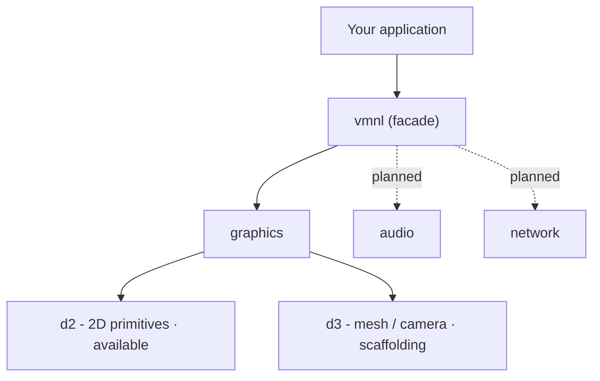

<div align="center">

# VMNL

**Vulkan Multimedia Networking Library**

A low-level, explicit, and modular Rust foundation for graphics, audio, and networking - built directly on Vulkan.

<br>


<br>


</div>

---

> [!WARNING]
> **Experimental.** The API is unstable, modules are incomplete, and breaking changes are expected on every release. Do not use in production.

## Table of Contents

- [Overview](#overview)
- [Design Principles](#design-principles)
- [Architecture](#architecture)
- [Status](#status)
- [Installation](#installation)
- [Building from Source](#building-from-source)
- [Roadmap](#roadmap)
- [References](#references)
- [Authors](#authors)
- [License](#license)

---

## Overview

**VMNL** is a Rust library built directly on the Vulkan API. It provides a predictable, high-performance, and modular base for game engines, real-time applications, and rendering systems.

It unifies three domains under a single, coherent surface:

| Domain        | Purpose                                  |
| ------------- | ---------------------------------------- |
| **Graphics**  | Explicit Vulkan rendering pipeline       |
| **Audio**     | Real-time audio (planned)                |
| **Network**   | Multiplayer / streaming transport (planned) |

The guiding constraint is simple: **no hidden complexity, only structured complexity.**

---

## Design Principles

VMNL is a thin abstraction over Vulkan. Its design principles double as the guarantees the library upholds - each one is meant to be observable and testable:

- **Explicit control** - GPU resources, synchronization, pipelines, queues, and device selection are chosen by the caller, never inferred.
- **No hidden cost** - no implicit allocation, no implicit state mutation.
- **Deterministic behavior** - identical inputs produce identical execution paths.
- **No global state** - nothing lives in a static singleton; ownership is explicit.
- **Modular** - `graphics`, `audio`, and `network` are independent and composable.
- **Reproducible architecture** - explicit device / queue selection makes runs comparable across machines.

---

## Architecture



VMNL exposes two layers:

- **Low-level** - a thin, clear abstraction over Vulkan with full control over memory, pipelines, synchronization, and shader compilation.
- **High-level** - ergonomic helpers for windows, textures, text, and a scene system, plus utilities such as bounds queries (`get_global_bounds`, `intersects`, `contains`, `compute_aabb`), upload helpers (`upload_buffer`, `upload_texture_with_staging`, `generate_mipmaps`), batched drawing, 2D/3D camera creation, and debug primitives.

---

## Status

### Graphics - available

- Vulkan instance / device setup
- Physical device selection (no surface dependency)
- Queue family management
- Swapchain lifecycle
- Render pass + framebuffer
- Graphics pipeline
- Vertex buffers
- Push constants
- Command buffers
- Frame synchronization
- 2D shape primitives (`vmnl_graphics::d2`)
- Render API with explicit 2D / 3D pass separation

### Graphics - scaffolding only

- 3D mesh and camera API (`vmnl_graphics::d3`) - **API exists, rendering not yet implemented**

### Windowing / Input - available

- Event polling
- Monitor enumeration
- Keyboard / mouse input
- Cursor management

### Module overview

| Area                | State            |
| ------------------- | ---------------- |
| Graphics - 2D       | Available        |
| Graphics - 3D       | Scaffolding only |
| Windowing / Input   | Available        |
| Audio               | Planned          |
| Networking          | Planned          |

---

## Installation

```bash
cargo add vmnl
```

Minimal entry point:

```rust
use vmnl::*;
```

> The public API is unstable. Pin an exact version (`vmnl = "=x.y.z"`) until a freeze is announced. Runnable examples live in the repository.

### Requirements

- Rust (stable) + Cargo
- A Vulkan loader (`libvulkan.so`, `vulkan-1.dll`, `libvulkan.dylib`)
- A Vulkan-compatible GPU

---

## Building from Source

```bash
git clone https://github.com/VMNL/vmnl.git
cd vmnl
cargo build
```

---

## Roadmap

**Short-term**
- Instance / device stabilization
- Window / renderer stabilization
- Input system
- Resource management
- Audio module

**Mid-term**
- Texture rendering + system (staging, batching, mipmaps)
- Text rendering
- Real batched 2D renderer
- 3D Vulkan backend (depth, pipelines, transforms)
- Scene system
- High-level API utilities

**Long-term**
- Networking
- Cross-platform robustness
- API freeze
- ECS
- C / C++ bindings

---

## References

- [Vulkan Specification](https://registry.khronos.org/vulkan/) - Khronos Group
- [Vulkano](https://vulkano.rs/) - Rust Vulkan wrapper
- [GLFW](https://www.glfw.org/) - windowing / input reference

---

## Authors

| Name | Role |
| ---- | ---- |
| [Hugo Duda](https://github.com/HugoDuda) | Lead tech - Vulkan / GLFW, low-level & high-level referent / developer |
| [Maxence Pierre](https://github.com/Anexoms) | Product owner & low-level developer |
| [Nathan Flachat](https://github.com/NathanFlachat) | Low-level / high-level developer |
| [Naouel Bouhali](https://github.com/BouhaliNaouel) | High-level developer |
| [Julien Michel](https://github.com/JulienMICHELgithub) | Web referent / developer |
| [Laszlo Serdet](https://github.com/lszsrd) | Networking referent / developer |

---

## License

See [LICENSE](LICENSE).