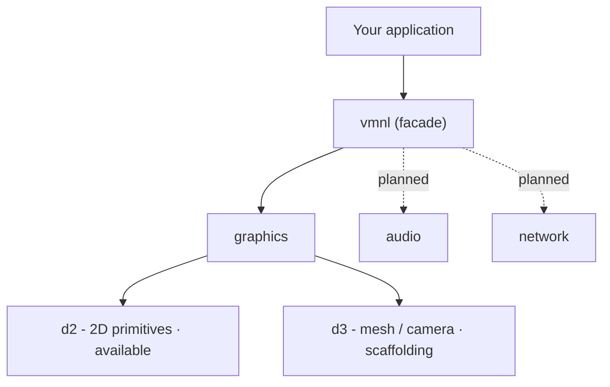

<div align="center">

# VMNL

**Vulkan Multimedia Networking Library**

A modular Rust foundation for Vulkan graphics, audio, and networking, from useful defaults to
explicit low-level control.

<br>


<br>


</div>

---

> [!WARNING]
> **Experimental and not yet released.** The API may change while the initial `0.1.0` contract is
> prepared. Do not use in production.

## Table of Contents

- [Overview](#overview)
- [Design Principles](#design-principles)
- [Architecture](#architecture)
- [Status](#status)
- [Installation](#installation)
- [Building from Source](#building-from-source)
- [Technical Documentation](#technical-documentation)
- [Roadmap](#roadmap)
- [References](#references)
- [Authors](#authors)
- [License](#license)

---

## Overview

**VMNL** is a modular Rust library for building a game engine, a real-time application, or a game
without first implementing a complete engine. Its graphics domain uses Vulkan; audio and networking
are planned as independent domains with their own backends.

It is designed to compose three domains behind one facade:

| Domain        | Purpose                                  |
| ------------- | ---------------------------------------- |
| **Graphics**  | Explicit Vulkan rendering pipeline       |
| **Audio**     | Real-time audio (planned)                |
| **Network**   | Transport, framing, and reliable/unreliable channels (planned) |

The guiding constraint is progressive control: start with documented defaults, replace only the
policies that matter, and descend to explicit raw control without changing the conceptual model.

---

## Design Principles

VMNL applies these principles to every stable public contract:

- **Progressive control** - every observable default remains inspectable and replaceable.
- **Predictable costs** - allocations, uploads, synchronization, waits, and managed work are
  documented where they occur.
- **Explicit ownership** - resources, lifetimes, thread affinity, and application-visible state have
  identifiable owners.
- **Scoped determinism** - VMNL claims deterministic behavior only for decisions it controls;
  backend and platform choices are reported explicitly.
- **Modularity** - graphics, audio, network, and optional high-level layers remain independently
  selectable and composable.
- **Safe defaults** - defaults simplify common use without removing lower-level control or accepting
  invalid public combinations silently.

---

## Architecture


```mermaid
flowchart TD
    APP["Your application"] --> VMNL["vmnl (facade)"]
    VMNL --> G["graphics"]
    VMNL -. planned .-> A["audio"]
    VMNL -. planned .-> N["network"]
    G --> D2["d2 - 2D primitives · available"]
    G --> D3["d3 - mesh / camera · scaffolding"]
```

VMNL exposes a control ladder:

- **High-level** - documented defaults and optional helpers for common game/application workflows.
- **Explicit configuration** - callers replace each observable policy relevant to their use case.
- **Raw VMNL** - low-level pipeline, geometry, resource, and synchronization control without making
  Vulkano part of the stable public API.
- **Backend interoperability** - an explicitly unstable escape hatch when raw VMNL is insufficient.

Textures, text, batching, an operational 3D backend, and scene helpers are planned rather than
current capabilities. The canonical direction and boundaries are documented in
[Architecture](docs/architecture.md).

---

## Status

### Graphics - available

- Vulkan instance / device setup
- Physical device selection (no surface dependency)
- Queue family management
- Swapchain lifecycle
- Render pass + framebuffer
- Graphics pipeline
- Vertex buffers
- Push constants
- Command buffers
- Frame synchronization
- 2D shape primitives (`vmnl_graphics::d2`)
- Render API with explicit 2D / 3D pass separation
- Raw typed pipelines, geometry, and uniform resources within documented limits

### Graphics - scaffolding only

- 3D mesh and camera API (`vmnl_graphics::d3`) - **API exists, rendering not yet implemented**

### Windowing / Input - available

- Event polling
- Monitor enumeration
- Keyboard / mouse input
- Cursor management

### Module overview

| Area                | State            |
| ------------------- | ---------------- |
| Graphics - 2D       | Available        |
| Graphics - 3D       | Scaffolding only |
| Windowing / Input   | Available        |
| Audio               | Planned          |
| Networking          | Planned          |

---

## Installation

VMNL has no public release and cannot currently be installed from crates.io. The first publication
will establish the `0.1.0` compatibility baseline. Until then, use a development checkout and
expect public contracts to change.

### Requirements

- Rust (stable) + Cargo
- Just
- A Vulkan loader (`libvulkan.so`, `vulkan-1.dll`, `libvulkan.dylib`)
- A Vulkan-compatible GPU

---

## Building from Source

```bash
git clone https://github.com/VMNL/vmnl.git
cd vmnl
just build-workspace
```

---

## Technical Documentation

Technical documentation starts at [docs/README.md](docs/README.md).

- [Getting Started](docs/getting_started.md)
- [Coding Instructions](docs/INSTRUCTIONS.md)
- [Build and platform support](docs/build.md)
- [Testing](docs/testing.md)

---

## Roadmap

1. **`0.1.0`** - stable window/input, 2D shapes, minimal raw graphics, and an operational audio
   contract.
2. **`0.2.0`** - textures without breaking `0.1.0`; text, batching, and networking begin in
   parallel.
3. **Later `0.x`** - scene helpers, operational 3D, broader networking, and reference
   applications.
4. **`1.0.0`** - complete stable Rust domains, qualified platform support, stable C ABI, priority
   C++ wrapper, and demonstrated high-level game and low-level engine paths.

VMNL preserves published `0.x` Rust contracts after `0.1.0`; deprecated APIs remain until `1.0.0`.
See [Deployment](docs/deployment.md) for the exact compatibility, release, and distribution policy.

---

## References

- [Vulkan Specification](https://registry.khronos.org/vulkan/) - Khronos Group
- [Vulkano](https://vulkano.rs/) - Rust Vulkan wrapper
- [GLFW](https://www.glfw.org/) - windowing / input reference

---

## Authors

| Name | Role |
| ---- | ---- |
| [Hugo Duda](https://github.com/HugoDuda) | Product Owner · Graphics Lead (low-level & high-level) |
| [Maxence Pierre](https://github.com/Anexoms) | Low-level developer |
| [Nathan Flachat](https://github.com/NathanFlachat) | Low-level & high-level developer |
| [Naouel Bouhali](https://github.com/BouhaliNaouel) | High-level developer |
| [Julien Michel](https://github.com/JulienMICHELgithub) | Web Lead |
| [Laszlo Serdet](https://github.com/lszsrd) | Networking Lead |

---

## License

See [LICENSE](LICENSE).
