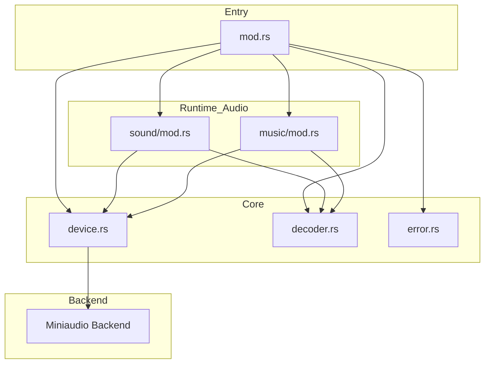
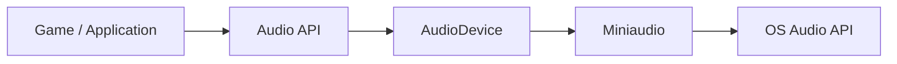
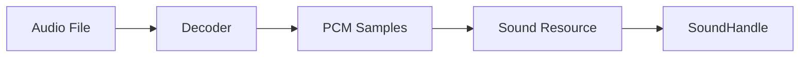
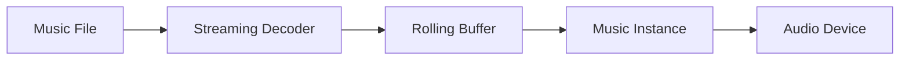
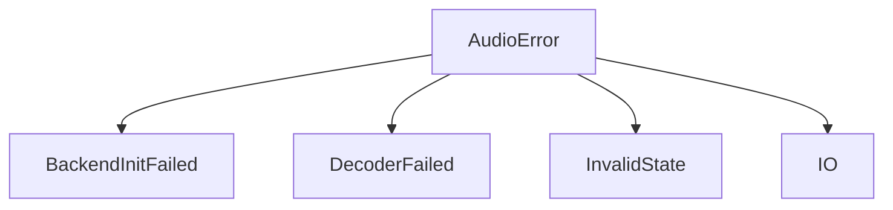

# Audio Architecture

```mermaid
flowchart TB

    subgraph Entry
        MOD[mod.rs]
    end

    subgraph Core
        DEVICE[device.rs]
        DECODER[decoder.rs]
        ERROR[error.rs]
    end

    subgraph Runtime_Audio
        SOUND[sound/mod.rs]
        MUSIC[music/mod.rs]
    end

    subgraph Backend
        MINI[Miniaudio Backend]
    end

    MOD --> DEVICE
    MOD --> DECODER
    MOD --> ERROR
    MOD --> SOUND
    MOD --> MUSIC

    SOUND --> DEVICE
    SOUND --> DECODER

    MUSIC --> DEVICE
    MUSIC --> DECODER

    DEVICE --> MINI
```

---

# Backend Architecture

```mermaid
flowchart LR

    APP[Game / Application]
    AUDIO[Audio API]
    DEVICE[AudioDevice]
    MINI[Miniaudio]
    OS[OS Audio API]

    APP --> AUDIO
    AUDIO --> DEVICE
    DEVICE --> MINI
    MINI --> OS
```

---

# Sound Architecture

```mermaid
flowchart LR

    FILE[Audio File]
    DECODER[Decoder]
    PCM[PCM Samples]
    SOUND[Sound Resource]
    HANDLE[SoundHandle]

    FILE --> DECODER
    DECODER --> PCM
    PCM --> SOUND
    SOUND --> HANDLE
```

---

# Music Streaming Architecture

```mermaid
flowchart LR

    FILE[Music File]
    DECODER[Streaming Decoder]
    BUFFER[Rolling Buffer]
    MUSIC[Music Instance]
    OUTPUT[Audio Device]

    FILE --> DECODER
    DECODER --> BUFFER
    BUFFER --> MUSIC
    MUSIC --> OUTPUT
```

---

# Error Architecture

```mermaid
flowchart TD

    ERROR[AudioError]

    ERROR --> A[BackendInitFailed]
    ERROR --> B[DecoderFailed]
    ERROR --> C[InvalidState]
    ERROR --> D[IO]
```

